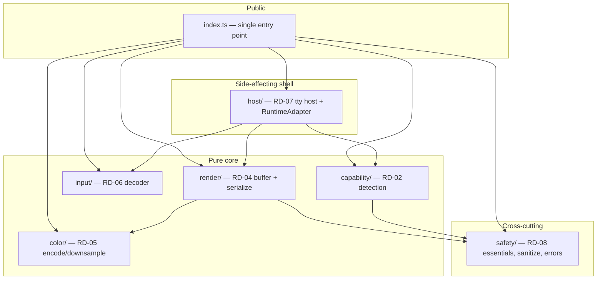

# System Overview

> **Last Updated**: 2026-06-28

## Architecture Style

`@blendsdk/tui` is a **foundation-first, layered library** with a single public
entry point (`src/engine/index.ts`). Each subsystem is a self-contained module
folder under `src/engine/**` that re-exports its public surface through the root
index; consumers import everything from `@blendsdk/tui` and never reach into a
module's internals.

The style is deliberately **pure-core / thin-shell**: rendering, decoding, colour
encoding, and capability resolution are pure functions over plain data, while the
only stateful, side-effecting layer (the host) is isolated behind an injectable
`RuntimeAdapter`. This was chosen so the entire engine is testable without a real
terminal — golden-screen tests drive a headless emulator, restore-on-exit is
proven with a fake adapter, and decoding is fuzzed as a pure transform. See
[ADR-003](/decisions/ADR-003-pure-core-injectable-seams) and
[ADR-004](/decisions/ADR-004-no-node-pty).

## Component Architecture

## Component Responsibilities

### Capability detection (`capability/`, RD-02)

- **Purpose**: Resolve a frozen `CapabilityProfile` (colour depth, glyphs, mouse,
  keyboard, OSC, sync) from environment, a static table, and an optional bounded
  live terminal query. Doubles as runtime auto-configuration ([ADR-002](/decisions/ADR-002-capability-auto-config)).
- **Inputs**: `env`, `platform`, optional `TerminalQuery` seam, `timeoutMs`.
- **Outputs**: `resolveCapabilities` (sync) / `resolveCapabilitiesAsync` (with layer-2 query).
- **Dependencies**: safety (sanitize/redaction); the host supplies the real `TerminalQuery`.

### Input decoder (`input/`, RD-06)

- **Purpose**: Turn raw input bytes into typed `InputEvent`s (keys, mouse, wheel,
  paste, focus, query responses) as a pure transform with a small carry buffer.
- **Inputs**: byte chunks + `DecoderState`.
- **Outputs**: `decode` / `flush` / `createDecoderState` / `createKeymap`.
- **Dependencies**: none (pure); bounded buffers (paste/response caps).

### Rendering engine (`render/`, RD-04)

- **Purpose**: A width-correct `ScreenBuffer` apps draw into, and a pure
  `serialize` that emits the minimal ANSI to turn the previous frame into the
  current one (damage diff). Bytes are proportional to damage.
- **Inputs**: `ScreenBuffer` (current/previous) + `RenderOptions` (caps + optional encoder).
- **Outputs**: `serialize`, `ScreenBuffer`, glyph fallback, cursor/OSC helpers.
- **Dependencies**: colour (default `StyleEncoder`), safety (`sanitize`).

### Color & styling (`color/`, RD-05)

- **Purpose**: Depth-aware SGR encoding — downsample truecolor→256→16→mono via a
  redmean nearest-colour search; merge attrs + fg + bg into one SGR. It is the
  default encoder `serialize` injects ([ADR-006 references the seam](/decisions/ADR-003-pure-core-injectable-seams)).
- **Outputs**: `encode`, `encodeStyle`, `nearest256`, `nearest16`, `PALETTE`, `defaultTheme`.

### Host & lifecycle (`host/`, RD-07)

- **Purpose**: The only stateful subsystem — raw mode, alt-screen entry/exit,
  signal handling, suspend/resume, and **guaranteed restore on every exit path**,
  all behind an injectable `RuntimeAdapter`. Also hosts the real tty-backed
  `createTerminalQuery` (RD-03) that completes RD-02's layer-2 wiring.
- **Outputs**: `createHost`, `detectTty`, `createTerminalQuery`.

### Safety (`safety/`, RD-08)

- **Purpose**: The essentials gate (`evaluateEssentials`/`assertEssentials`), the
  screen-safe logger, `redactEvent`/`dumpCaps`, the typed `TuiError` model, and the
  canonical `sanitize` injection boundary ([ADR-005](/decisions/ADR-005-sanitize-boundary)).

## Communication Patterns

| From   | To         | Mechanism                            | Pattern        | Notes                              |
| ------ | ---------- | ------------------------------------ | -------------- | ---------------------------------- |
| App    | render     | `serialize(current, previous, opts)` | Sync, pure     | Host holds the previous frame      |
| Host   | capability | `TerminalQuery` seam                 | Async, bounded | Layer-2 query, `timeoutMs`-bounded |
| Render | color      | `StyleEncoder` injection             | Sync, pure     | Default = RD-05 `encodeStyle`      |
| Host   | runtime    | `RuntimeAdapter` injection           | Side-effecting | The single I/O seam                |

## Cross-Cutting Concerns

- **Auto-configuration**: capability detection adapts output to the terminal with
  zero app configuration.
- **Logging**: screen-safe logger never corrupts the alt-screen; redaction strips
  secrets/PII before any log.
- **Error handling**: a typed `TuiError` hierarchy; the render path degrades
  crash-safe rather than throwing on bad cell data.
- **Restore guarantee**: the host restores the terminal on normal exit, throw,
  `SIGINT`/`SIGTERM`/`SIGHUP`, proven by the RD-09 Tier-3 e2e.
