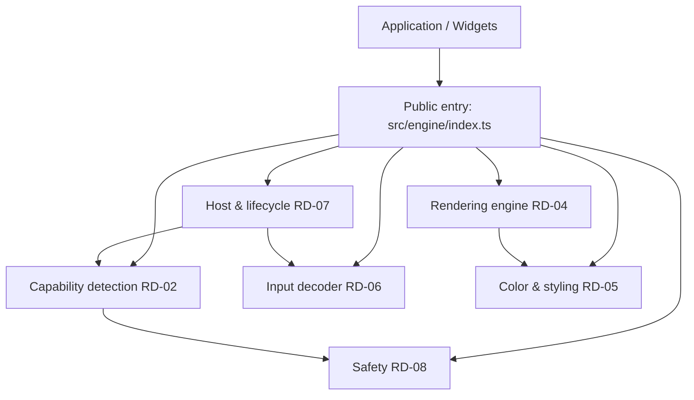

# jsvision — Technical Architecture

> **Project**: jsvision
> **Type**: Library / SDK (terminal UI foundation)
> **Tech Stack**: TypeScript (ESM-only, NodeNext, strict), Node ≥ 18, zero runtime dependencies
> **Last Updated**: 2026-06-28

---

## System Purpose

`@jsvision/core` is the foundation package of an SDK for building Turbo Vision-style
terminal (TUI) applications in TypeScript. It provides the cross-cutting machinery
a terminal app needs before any widget exists: detecting what the terminal can do,
decoding raw input bytes into events, composing and diffing a screen into minimal
ANSI, encoding colour for the detected depth, owning the terminal lifecycle (raw
mode, alt-screen, guaranteed restore), and a safety layer that keeps untrusted
bytes and screen state from corrupting the session.

It is written for application and widget authors who want a correct, capability-aware
rendering and input core without re-deriving terminal arcana. Everything is a pure
function or a thin seam over a Node built-in, so it is testable without a real TTY
and ships with **zero runtime dependencies**.

This package is the **foundation** only — widgets, layout, and an application
runloop are built on top of it, not inside it.

## Architecture at a Glance

## Key Components

| Component            | Module                   | Purpose                                           | Documentation                                    |
| -------------------- | ------------------------ | ------------------------------------------------- | ------------------------------------------------ |
| Capability detection | `src/engine/capability/` | Detect terminal capabilities; auto-configure      | [API Design](/architecture/api-design)           |
| Input decoder        | `src/engine/input/`      | Pure byte→event decoding (keys, mouse, paste)     | [API Design](/architecture/api-design)           |
| Rendering engine     | `src/engine/render/`     | Width-correct buffer + pure damage-diff serialize | [API Design](/architecture/api-design)           |
| Color & styling      | `src/engine/color/`      | Depth-aware SGR encoding (truecolor→256→16→mono)  | [API Design](/architecture/api-design)           |
| Host & lifecycle     | `src/engine/host/`       | Raw mode, alt-screen, signals, guaranteed restore | [System Overview](/architecture/system-overview) |
| Safety               | `src/engine/safety/`     | Essentials gate, sanitize boundary, typed errors  | [Security](/architecture/security)               |

## Technology Decisions

See [Architecture Decision Records](/decisions/) for the rationale behind the major
design choices (ESM-only zero-dep, capability auto-config, pure core behind
injectable seams, no node-pty, the canonical sanitize boundary, and the
informational performance bench).

## Getting Started

New to the project? Start with the [Getting Started Guide](/guides/getting-started),
then read the [System Overview](/architecture/system-overview).
